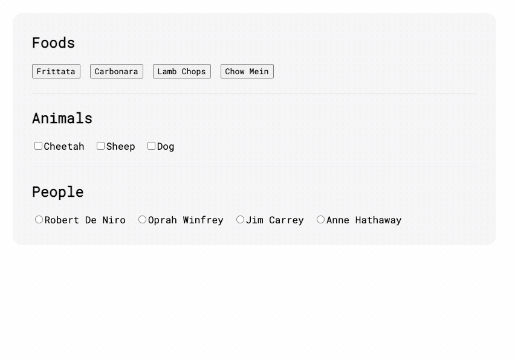

Add roving tabindex to your components.

[What's __roving tabindex__?](https://www.youtube.com/watch?v=uCIC2LNt0bk)

## Installation

```bash
npm i rovueing-tabindex
// Or
yarn add rovueing-tabindex
// Or
pnpm add rovueing-tabindex
```

## Demo 


## Usage

```javascript
import { RovueingTabindex } from 'rovueing-tabindex';

app.use(RovueingTabindex, {
    direction: "ltr" | "rtl" // default: "ltr"
});
```

```vue
<template>
    <ul id="foods" v-rove>
        <button v-rove-focusable>Frittata</button>
        <button v-rove-focusable>Carbonara</button>
        <button v-rove-focusable>Lamb Chops</button>
        <button v-rove-focusable>Chow Mein</button>
    </ul>
</template>
```

1. Import and register `rovuing-tabindex`
2. Use `v-rove` on the parent which contains focusable items and denotes the boundary of a roving tabindex. Use `v-rove-focusable.rtl` if you need to overwrite the default options.
3. Use `v-rove-focusable` on every focusable element inside the container parent.


## Contributing
Contributions, issues and feature requests are welcome.
Feel free to check issues page if you want to contribute.

## Author
Mehdi HoseiniPajooh

Twitter: [@Mehdi_HoseiniP](https://twitter.com/Mehdi_HoseiniP)  
Github: [@Mehdi-Hp](https://github.com/Mehdi-Hp)

## License
[DO WHAT THE FUCK YOU WANT TO PUBLIC LICENSE](./LICENSE)  
Version 2, December 2004

---

#### Related  
[vue-roving-tabindex](https://github.com/fork/vue-roving-tabindex#readme)